<div align="center">


<br>


</div>

<br>

<p align="center">
  
</p>

<br>

## 👨‍💻 About Me

```kotlin
class Hafis : Developer {
    override val stack = listOf("Java", "Kotlin", "PostgreSQL")
    override val currentlyLearning = "..."
    override val funFact = "..."

    fun sayHi() = println("Thanks for visiting my profile! 🚀")
}
```

<br>

## 🛠️ Tech Stack

<div align="center">


</div>

<br>

<div align="center">


</div>

<br>

## 📊 GitHub Stats

<div align="center">


<br>


</div>

<br>

## 🏆 Trophies

<div align="center">

</div>

<br>

## 🌐 Let's Connect

<div align="center">

<a href="https://linkedin.com/in/hafis-dev223" target="_blank">
  
</a>
<a href="mailto:email@example.com">
  
</a>
<a href="https://instagram.com/hafis-dev223" target="_blank">
  
</a>

</div>

<br>

<div align="center">
<i>⭐️ Thanks for stopping by — feel free to explore my repos!</i>
</div>
